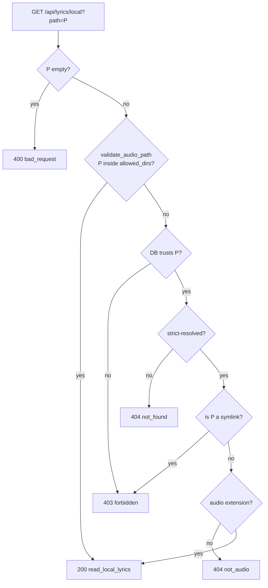

# Local Lyrics

A lyrics panel for the now-playing track. Local files win. Tidal is
the only network fallback, and only after local is `none`.

No Genius, no Google, no Musixmatch, no `lrclib.net`. The sanctioned
cloud source is the signed-in Tidal session's `track.lyrics()` — the
same object the download pipeline already uses (`text` unsynced,
`subtitles` LRC).

Synced LRC (sidecar, embedded timestamps, or Tidal subtitles) gets a
highlighted-line scroll view. Unsynced text renders as plain copy. If
nothing is available, the panel says so. It does not hang.

## What it reads

`read_local_lyrics` looks at two places, in priority order:

1. **Sidecar `.lrc`** in the same directory as the audio file.
2. **Embedded tags** inside the audio file itself.

Each source independently contributes "synced" and "unsynced" content;
the final local payload mode is picked by preference: synced sidecar →
synced embedded → unsynced sidecar → unsynced embedded → `none`.

If that result is `none` and Tidal is signed in, `lyrics_for_now_playing`
in [`tidal_dl/gui/lyrics_tidal.py`](../tidal_dl/gui/lyrics_tidal.py)
resolves a Tidal track from `tidal_track_id` (now-playing / probe) or
ISRC (query or library row → `quality_probes`, else title+artist
search with an ISRC match — the same resolve upgrade already uses)
and calls `track.lyrics()`. Synced subtitles become `tidal-synced`;
plain text becomes `tidal-unsynced`. Successful results, including
honest empty, are cached in-process (`TTLCache`, 1 hour). Transient
Tidal failures return 502 and are not cached.

`lyrics_embed` and `lyrics_file` stay **opt-in / default off**. They
only write tags or a sidecar at download time. Playback fetch is how
the existing library gets words without a re-download. When those
toggles are on, `metadata_write` uses `lyrics_obj_from_track` so a
Hi-Fi stub with empty `lyrics()` retries via the OAuth session.

The lyrics panel also has **Save lyrics**. When the now-playing track
has a local path and the current payload is from Tidal, that control
writes `<stem>.lrc` next to the audio file (the same sidecar
`discover_sidecar_lrc` reads). It does not overwrite a good existing
sidecar unless the caller sets `replace`. After a successful save,
`GET /api/lyrics/local` and later offline plays use the sidecar — no
Tidal, no network. This does **not** flip the global download toggles.

### Sidecar discovery

`discover_sidecar_lrc(audio_path)` in
[`tidal_dl/gui/lyrics_local.py`](../tidal_dl/gui/lyrics_local.py):

- Target filename is `<audio_stem>.lrc` in the audio's parent directory.
- Prefers an **exact-case** match.
- Falls back to **case-insensitive**, but only if there's exactly one
  match (ambiguous = no match, to avoid guessing).
- **Symlinks are explicitly excluded** — a symlinked sidecar could
  point at any file on disk, so the resolver would be an arbitrary
  file-read primitive. The check is `child.is_file() and not
  child.is_symlink()`.

### Embedded tags per format

| Format | Synced source | Unsynced fallback |
| --- | --- | --- |
| `.mp3` | — (ID3 USLT frames treated as unsynced) | `USLT` frames, preferring empty-desc + `eng` lang |
| `.m4a` | `©lyr` atom if it contains LRC timestamps | `©lyr` plain text → `----:com.apple.iTunes:UNSYNCEDLYRICS` atom |
| `.flac` | `LYRICS` vorbis tag if it contains LRC timestamps | `LYRICS` plain text → `UNSYNCEDLYRICS` tag |

Bytes values are decoded as UTF-8 with `errors="replace"`. The first
non-empty candidate wins.

## LRC parsing

`parse_lrc_text(text)` handles the subset of LRC we care about:

- **Timestamps** `[mm:ss]` or `[mm:ss.fff]` (1–3 digit fraction).
- **Multi-stamp lines** — `[00:10][00:30]Same lyric line` emits the
  same text twice at both start points.
- **Offset directive** `[offset:±ms]` shifts every subsequent
  timestamp by that many milliseconds.
- **Metadata directives** `[ar:...]`, `[ti:...]`, `[al:...]`, `[by:...]`
  are recognized and silently dropped.
- **BOM + stray `\ufeff`** stripped from every line.
- **Encoding fallback chain** for byte reads: `utf-8-sig`, `utf-8`,
  `utf-16`, then `utf-8` with replace.

`normalize_synced_lines(lines, duration_ms)` turns raw `[start_ms, text]`
pairs into renderable `[start_ms, end_ms, text]` windows:

- Sorted by `start_ms`.
- Lines with the same start are **merged** (joined with a newline) so
  background-vocal tracks render as a single block.
- Each line's `end_ms` is the next line's `start_ms`, or for the final
  line, the track duration if known, else `start_ms + 4000`.
- Invalid ranges (`end_ms <= start_ms`) are dropped.

Track duration comes from `mutagen` (`audio.info.length`) when
available, otherwise the fallback 4-second tail kicks in.

## Payload shape

Returned by `read_local_lyrics(audio_path)` and by the player endpoint
after a Tidal fallback (`lyrics_payload_from_tidal`):

```json
{
  "mode": "synced | unsynced | none",
  "track_path": "/absolute/resolved/path/to/track.flac",
  "lines": [
    { "start_ms": 10000, "end_ms": 13500, "text": "..." }
  ],
  "text": "plain unsynced body, newline-joined",
  "source": "lrc-synced | embedded-synced | lrc-unsynced | embedded-unsynced | tidal-synced | tidal-unsynced | none"
}
```

- `mode` drives which UI shell the panel renders.
- `source` is informational — lets the panel or a log show *where* the
  lyrics came from without leaking paths.
- `lines` is populated only in `synced` mode; `text` only in `unsynced`.
- `track_path` is the fully resolved absolute path for local audio, or
  `tidal:<id>` / `isrc:<ISRC>` for a Tidal-only now-playing track.

## API

Player route: `GET /api/lyrics?path=&tidal_track_id=&isrc=&duration=`.
Local-only debug route remains `GET /api/lyrics/local?path=`.

The `/lyrics` segment is set on the router in
[`tidal_dl/gui/api/lyrics.py`](../tidal_dl/gui/api/lyrics.py)
(`APIRouter(prefix="/lyrics")`); `api/__init__.py` just includes that
router unmodified under the top-level `/api` mount.

`GET /api/lyrics` identity rules:

- At least one of `path`, `tidal_track_id`, or `isrc` is required
  (else 400).
- A valid `path` is resolved the same way as `/local`. If
  `read_local_lyrics` is not `none`, that payload is returned and
  Tidal is not contacted.
- If local is `none` (or there is no path) and the Tidal session is
  signed in, fetch via `track.lyrics()` and cache.
- Tidal-only now-playing tracks send `tidal_track_id` with no path.

`POST /api/lyrics/save` (CSRF required) writes `<stem>.lrc` next to a
resolved local audio path from the panel payload (`lines` for synced,
`text` for unsynced). 409 if a good sidecar already exists and
`replace` is false. Returns the local `read_local_lyrics` payload.

Resolution branches:

```
path resolution → resolve_local_audio_path(path, allowed_dirs,
                                            library_trusts_raw_path=...,
                                            library_resolved_path=...)
  ok          → read_local_lyrics(resolution.path)  → 200 JSON payload
  bad_request → 400  (missing or invalid raw path)
  forbidden   → 403  (raw path outside allowed dirs AND not in library DB,
                      OR raw path is a symlink even if DB-trusted)
  not_found   → 404  (raw path DB-trusted but strict-resolve failed)
  not_audio   → 404  (resolved path's extension not in AUDIO_EXTENSIONS)
```

"Raw path" = the string the caller sent. "Resolved path" = what
`Path.resolve()` turned it into. The distinction matters: the
symlink check is on the raw path (so scan-time bypasses don't help
the caller), and the audio-extension check is on the resolved path
(so a symlink-safe, DB-trusted file must still have an audio suffix
after resolution).

`GET /api/lyrics` and `GET /api/lyrics/local` are **read-only** and
carry the standard CSRF-not-required contract for `GET`.
`POST /api/lyrics/save` requires CSRF. Cross-site reads are blocked by
the host/CORS middleware in `security.py`.

## Path safety

`resolve_local_audio_path` in
[`tidal_dl/gui/security.py`](../tidal_dl/gui/security.py) is the
single chokepoint. It enforces a **two-step trust model**:

1. **Primary trust: `allowed_dirs`.** The raw path must strict-resolve
   *inside* one of the configured library roots. If it does, return OK
   immediately.
2. **Fallback trust: the library DB.** If the raw path doesn't match
   any allowed dir, fall back to "is this path indexed in the library
   DB?". Even a DB-trusted path is rejected if:
   - the raw path is a **symlink** (belt-and-suspenders against
     scan-time bypass or stale DB entries), or
   - the strict-resolved path has an **extension not in
     `AUDIO_EXTENSIONS`**.



Caller owns the DB lookup so `security.py` stays import-clean
(CodeQL hardening: keeps the security module free of library-DB
imports that would pull audio-path lookup into the trust boundary).
`api/lyrics.py` computes
`library_trusts_raw_path` and `library_resolved_path` via
`_path_in_library` + `_trusted_library_path` from
`tidal_dl/gui/api/library.py` and passes them in.

## Resource limits

- `MAX_LRC_BYTES = 1 MiB`. Sidecar files larger than this are skipped
  with no parse attempt. No legitimate `.lrc` approaches this — the
  cap exists purely to prevent a crafted sidecar from DoSing the GUI
  process.
- No limit on embedded tag size. Mutagen's own parsing already refuses
  pathologically large tags.

## Frontend

The lyrics panel lives in
[`tidal_dl/gui/static/player.js`](../tidal_dl/gui/static/player.js)
(`lyricsState`, `openLyricsPanel`, `loadLyricsForCurrentTrack`,
`renderLyricsPanel`, `_applyLyricsPayload`).

Behavior:

- Panel opens for any now-playing track with a local path, a Tidal
  id, or an ISRC. `#btn-lyrics` is no longer `is_local`-only.
- Fetch goes to `GET /api/lyrics` (local first, then Tidal). Client
  and server both cache the payload for the current request key.
- Every fetch increments `lyricsRequestToken`. Late responses from a
  previous track are dropped when the token no longer matches — a
  classic "last write wins" race guard so switching tracks quickly
  never renders stale lyrics against a new now-playing.
- Payload validation (`validateLyricsPayload`) rejects malformed or
  missing fields before rendering.
- States: `closed`, `loading`, `synced`, `unsynced`, `empty`, `error`.
- Reduced-motion users (`prefers-reduced-motion: reduce`) skip the
  line-scroll animation.
- Closing the panel restores keyboard focus to the element that opened
  it (`focusReturnEl`).
- **Save lyrics** (`#lyrics-save`) shows when the track has a local
  path and the payload source is `tidal-synced` or `tidal-unsynced`.
  A successful save cache-busts the panel and shows the local sidecar
  source. Tidal-only streams with no file on disk have nothing to
  write next to, so the control stays hidden.

## Testing

- `tests/test_gui_lyrics_backend.py` — resolver + parser coverage
  (timestamps, offsets, BOM, encoding fallback, symlink rejection,
  embedded tag dispatch, mode selection, Tidal payload, local-first
  order, in-process Tidal cache, Hi-Fi → OAuth lyrics retry, sidecar
  save and no-overwrite).
- `tests/test_gui_lyrics_api.py` — `/local` resolution branches plus
  `/lyrics` local-first, Tidal fallback, Tidal-only now-playing,
  missing-identity 400, and `POST /save` (offline reread, keep
  existing sidecar, forbidden path).
- `tests/test_gui_lyrics_frontend.py` — panel chrome, Tidal sources,
  now-playing Lyrics gate, and Save lyrics control.

## What is intentionally out of scope

- **No third-party lyrics APIs.** No `lrclib.net`, no Musixmatch, no
  Genius. The only network source is the signed-in Tidal session.
- **No translation / transliteration.** Render local files or Tidal
  lyrics as returned.
- **No live scroll when seeking.** Scroll follows playback position;
  scrubbing re-aligns on the next render tick.
- **No silent global write.** `lyrics_embed` / `lyrics_file` remain
  download-time opt-in (default off). Panel Save lyrics writes one
  sidecar for the current local file when the user asks.
